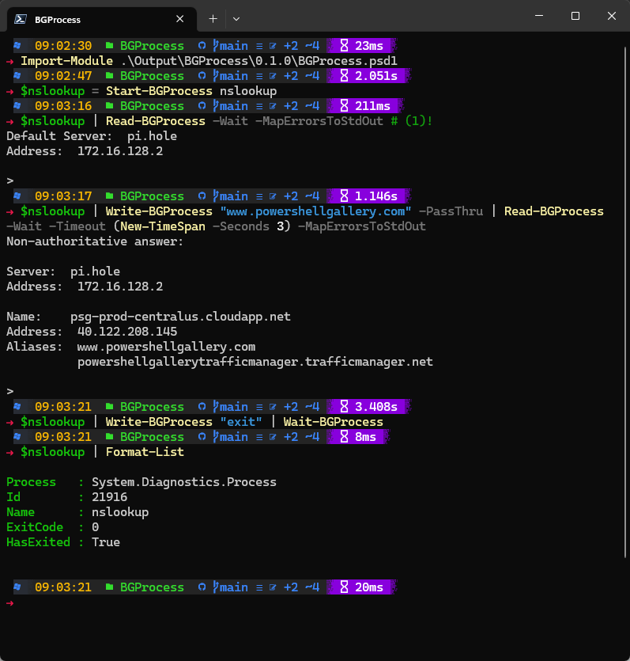

# Welcome
[](https://github.com/joshooaj/BGProcess/actions/workflows/Publish.yml)
[](https://github.com/joshooaj/BGProcess/actions/workflows/PublishDocs.yml)
## Introduction

It can be complicated to read from the StandardOutput or StandardError streams
on a [`[System.Diagnostics.Process]`](https://learn.microsoft.com/en-us/dotnet/api/system.diagnostics.process?view=net-7.0) object - especially without the risk of
blocking the terminal indefinitely.

This module is intended to simplify reading the output of a running process,
and reacting to it by writing to the StandardInput stream. Imagine for example
that you are required to use a command-line utility which cannot be executed
with simple command-line arguments. Instead, the utility prompts you to fill in
one or more pieces of information. Reading from StandardOutput synchronously
can result in locking up your PowerShell session if you call a `Read` method
and there is no data to be read from the stream yet.

When you use the `Start-BGProcess` cmdlet, the process is started and both
StandardOutput and StandardError streams are monitored asynchronously. When you
use `Read-BGProcess`, any data available from these streams will be returned
without blocking. Combine this with `Write-BGProcess` and you can easily
automate a stubborn command-line tool that is not automation-ready.

## Installation

The module can be installed from [PowerShell Gallery](https://www.powershellgallery.com/packages/BGProcess)
by running the command `Install-Module -Name BGProcess`.

To install manually, you can download latest `BGProcess.zip` file from the
[Releases](https://github.com/joshooaj/BGProcess/releases) section, and extract
it to one of your PSModulePath's.

Type `$env:PSModulePath -split ';'` in a PowerShell terminal to see where
PowerShell looks for modules on your system.

When extracted to a standard module path, the full path to `BGProcess.psd1`
should be similar to...

- __Current user:__ C:\Users\<username>\Documents\WindowsPowerShell\Modules\BGProcess\0.1.0\BGProcess.psd1
- __All users:__ C:\Program Files\WindowsPowerShell\Modules\BGProcess\0.1.0\BGProcess.psd1

## Usage

I can't think of a good reason to use `nslookup.exe` this way, but it is used
as an example because it is readily available on any Windows system and if you
launch it without arguments it will present you with a prompt.

Here's a simple use case - see the screenshot below to see what it looks like
in the terminal. In a more complex scenario you would inspect the response from
`Read-BGProcess` and either wait for some particular string, or branch out and
perform different actions depending on the content.

```powershell linenums="1"
$nslookup = Start-BGProcess nslookup # (1)
$nslookup | Read-BGProcess -Wait -MapErrorsToStdOut # (2)
$nslookup | Write-BGProcess "www.powershellgallery.com" -PassThru | Read-BGProcess -Wait -Timeout (New-TimeSpan -Seconds 3) -MapErrorsToStdOut # (3)
$nslookup | Write-BGProcess "exit" | Wait-BGProcess # (4)
$nslookup | Format-List # (5)
```

1. Launches a windowless nslookup `[System.Diagnostics.Process]` and
   encapsulates it in a [BGProcess] class which takes care of monitoring
   stdout/stderr for you.
2. Reads any data available on stdout and stderr. The `-MapErrorsToStdOut`
   switch is used here because nslookup writes "Non-authoritative answer:" to
   stderr and I'd rather see that as part of stdout. Also, since processes
   don't always write output all at once, there's a default timeout of 1 second
   before `Read-BGProcess` assumes there is no more data to be read.
3. Writes a DNS name to the StandardInput stream, and then waits until the
   process output has been idle for 3 seconds before returning control.
4. Writes "exit" to StandardInput, and waits until the `nslookup.exe` process
   exits.
5. Writes the `$nslookup` `[BGProcess]` object to the terminal.



## Known issues

- When an application writes to both StandardOutput and StandardError, there is
  no preservation of order for the output. The StandardError stream is written
  out from `Read-BGProcess` before the StandardOutput stream, so even if the
  text in the StandardError stream was written at the very end, it will be
  output first. This might be mitigated by switching from reading from the
  StandardOutput and StandardError BaseStreams to subscribing to the
  [OutputDataReceived](https://learn.microsoft.com/en-us/dotnet/api/system.diagnostics.process.outputdatareceived?view=net-7.0) and [ErrorDataReceived](https://learn.microsoft.com/en-us/dotnet/api/system.diagnostics.process.errordatareceived?view=net-7.0) events. In theory, these events
  should be fired in order, and then it should be easy to maintain the output
  order. It may also reduce complexity by eliminating the need for runspaces.
- On linux, it does not appear that the [Exited](https://learn.microsoft.com/en-us/dotnet/api/system.diagnostics.process.exited?view=net-7.0)
  event handler gets called, so the `ExitCode` and `HasExited` properties do not
  seem to be updated automatically. Something to look into.
